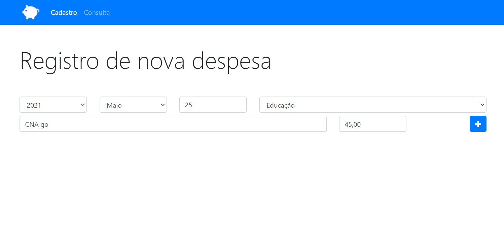
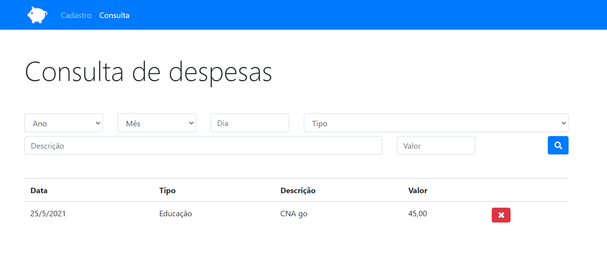

# Orçamento Pessoal
## Aplicação para orçamento pessoal utilizando html, css e javaScript
<h1 align="center">
  
</h1>

 <a href="#sobre-o-projeto">Sobre</a> •
 <a href="#funcionalidades">Funcionalidades</a> •
 <a href="#layout">Layout</a> • 
 <a href="#tecnologias">Tecnologias</a> • 

<h4 align="center"> 
	 Orçamento Pessoal 💸 Finalizado
</h4>

## 💸 Sobre o projeto

💸 O Orçamento pessoal foi criado com javaScript sendo um projeto desenvolvido durante o curso de Desenvolvimento Web ministrado pelo professor Jorge Sant' Ana.

Esse projeto foi desenvolvido para o estudo de implementação de conceitos básicos e introdutórios em javaScript, abordando temas como Destructuring Assignment, Operador Rest/Spread, Prototype...
---

## ⚙Funcionalidades

-Basicamente o projeto consiste em duas páginas html sendo uma responsável pelo registro da despesa, e a outra pela consulta da despesa com a possibilidade de exclusão. 

-Na tela de registro de despesa existe diversos campos para serem preenchidos para que possa ser cadastrado a despesa com sucesso sendo esses campos:
  - Referente a data com um campo para ano, mês e dia;
  - Um campo para o tipo, onde existe as categorias ja predefinidas como alimentação, educação, lazer, saúde e transporte;
  - Também existe um campo para a descrição onde pode armazenar um texto digitado pelo usuário;
  - E por ultimo o campo valor referende a despesa.
  
  
  
  <h3> Ná página de consulta de despesa:</h3>
  
  -Similar com a página de registro, a página de consulta de despesas apresenta a possibilidade de listar filtrar e excluir despesas salvas no navegador através do local storage.
  
  
  ---

## 🎨Layout

O layout foi fornecido pelo professor 
[Jorge Sant' Ana](https://www.linkedin.com/in/jorgesantanabr/).

### 🛠Tecnologias

As seguintes ferramentas foram usadas na construção do projeto:

- [HTML](https://www.w3schools.com/html/default.asp)
- [CSS](https://www.w3schools.com/css/)
- [JS](https://developer.mozilla.org/pt-BR/docs/Web/JavaScript)
- [Bootstrap](https://getbootstrap.com/)
- [VisualStudio](https://visualstudio.microsoft.com/pt-br/)
